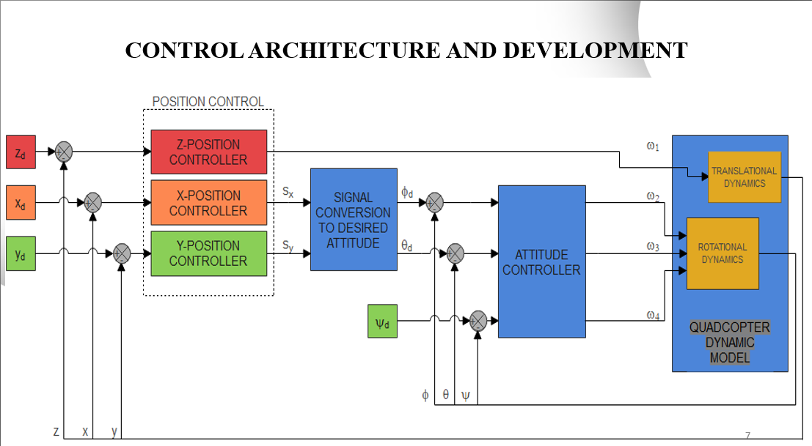

# Quadcopter Control

 
 

<table>
  <tr>
    <td></td>
    <td></td>
  </tr>
</table>
 

 

<b>MODELLING AND NONLINEAR CONTROL OF A QUADCOPTER FOR STABILIZATION AND TRAJECTORY TRACKING</b>

 

## ➡️ Languages | Technologies
<table>
  <tr>
    <td>Programming Languages</td>
    <td>MATLAB</td>
  </tr>
</table>
 

## ➡️ Outline
* INTRODUCTION
* AIM & OBJECTIVES OF THE STUDY
* SYSTEM MODELLING
* CONTROL ARCHITECTURE AND DEVELOPMENT
* MATLAB CODE USE
* PID STABILIZATION RESULTS
* TRAJECTORY TRACKING RESULTS
* ACHIEVEMENT AND CONCLUSION
  

## ➡️ Introduction
A quadcopter, also known as a quadrotor, is an unmanned aerial vehicle propelled by four rotors in cross-configuration. A quadcopter's dynamics are extremely nonlinear, it is an underactuated system with six degrees of freedom and four control inputs which are the rotor velocities. 
The number and complexity of applications for quadcopter systems continues to grow on a daily basis, the control techniques that are employed must also improve in order to enhance performance and adaptability to new situations. This thesis would be studying the modelling of the quadcopter system and nonlinear control methods that can be implemented on the system for stability and trajectory tracking.
 

## ➡️ Aim and Objectives of the Study
The project aims to develop a mathematical model of a quadcopter system and implement nonlinear control techniques on the derived model for stabilization and trajectory tracking of a quadcopter. The objectives of this project are to:
* Develop the mathematical model of a quadcopter system dynamics.
* Develop a PID control algorithm for the derived nonlinear quadcopter system dynamics.
* Derive the full state Feedback Linearized system of the derived nonlinear quadcopter system dynamics.
* Simulate and perform a comparative analysis of the implemented control techniques on the quadcopter system for stabilization and trajectory tracking.
  

## ➡️ System Modelling
The quadcopter system is complex and in order to control it, the quadcopter is modelled on the following assumptions:
* The structure is rigid
* The structure is axis symmetrical
* The Centre of Gravity and the body fixed frame origin coincide
* The propellers are rigid
* Thrust and drag are proportional to the square of the propeller’s speed

**The complete mathematical modelling of the quadcopter system is available in the Project Report**
  

## ➡️ Control Architecture and Development
<table>
  <tr>
    <td></td>
  </tr>
</table>

**The complete mathematical derivations of the PID, Feedback Linearization and Trajectory tracking control are available in the Project Report**
  

## ➡️ MATLAB Code
* Clone or download this repository
* Ensure MATLAB is installed on your system
* Open the `Quadcopter_Control.m` file with MATLAB
* Run the code and the results would be displayed in graphs

The following lines contain variables that should be adjusted to produce the required results:
* Line 12 - `implement_control = 1`; Select 0 to simulate without control and 1 to simulate with control.
* Line 17 - `param.control_type = 1`; Select 1 - stabilization, 2 - stabilization with modifications for x and y, 
3 - Trajectory tracking with PID, 4 - Trajectory tracking with PID and Feedback Linearization.
* Line 21 - `param.traj = 1`; Select 1 - Circular Trajectory, 2 - Spiral Trajectory.
* Line 25 - `param.time_change = 3`; Select 1 - 15s, 2 - 30s, 3 - 45s.
 

## ➡️ Results

 

## ➡️ Achievement and Conclusion
The aim and objectives stated at the beginning of the project have been achieved. 
* This thesis presented a mathematical method of mapping the desired position variables to the desired angles to stabilize all the states including the position variables to zero
* It also provides the complete derivation of the feedback linearized system based on the full state Nonlinear Dynamic Inversion (NDI) technique.
* The FBL system was computed and simulated without small signal approximations.

The results from simulation show that the PD control produces satisfactory results for system stabilization but fails to do so for trajectory tracking of the quadcopter. Hence the need of a different control technique called the feedback linearization control which produces excellent results for trajectory tracking of the quadcopter system. 
 

## ➡️ Novelty of the Project
PD controller was used for attitude stabilization which is to stabilize the angles to zero state but the position variables cannot be stabilized because the state variables are not observable (normal approach). I tried a new approach which I didn’t see in other articles where I mapped the position variables to the angle variables which are controllable so I could drive all states to zero stability which I achieved but the downside is that it takes a longer time to achieve this stability so it’s not efficient and should only be considered when absolute zero stability is the aim without considering time efficiency.

Another one was the full derivation of the Feedback linearization system control using the principle of NDI(Non linear Dynamic Inversion). I didn’t come across the full calculation and derivation in any quadcopter system article so this was done personally and also majority made use of the FBL system with small angle approximations but I did mine without those approximations.
 

## ➡️ References
* M. Etemadi, “Mathematical dynamics, kinematics modeling and PID equation controller of quadcopter,” Int. J. Appl. Oper. Res. Open Access J., vol. 7, no. 1, pp. 77–85, 2017.
* S. Bouabdallah, “Design and control of quadrotors with application to autonomous flying,” Epfl, 2007.
* F. Sabatino, “Quadrotor control: modeling, nonlinearcontrol design, and simulation.” 2015.
* T. Luukkonen, “Modelling and control of quadcopter,” Indep. Res. Proj. Appl. Math. Espoo, vol. 22, p. 22, 2011.
* A. Zulu and S. John, “A review of control algorithms for autonomous quadrotors,” arXiv Prepr. arXiv1602.02622, 2016.
* E. Gopalakrishnan, “Quadcopter flight mechanics model and control algorithms,” Czech Tech. Univ., vol. 69, 2017.
 

**THANK YOU!**